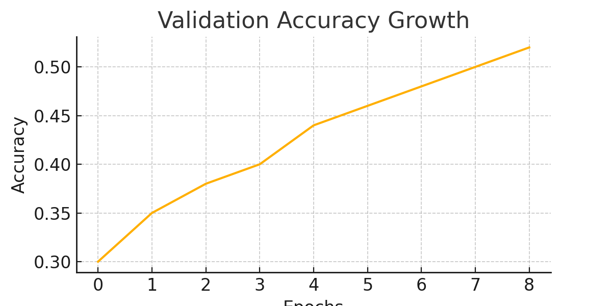

# Emotion Recognition Model (MobileNetV2 + FER2013)

This model classifies facial emotions into 7 categories: angry, disgust, fear, happy, neutral, sad, surprise.
It is based on transfer learning using MobileNetV2 and fine-tuned on the FER2013 dataset.

## 🧠 Training Summary

- Architecture: MobileNetV2 + custom classification head
- Dataset: [FER2013](https://www.kaggle.com/datasets/msambare/fer2013)
- Training: 15 epochs + 10 fine-tuning
- Accuracy: **0.52**
- Weighted F1-score: **0.48**

## 📈 Performance

The model performs best on: **happy**, **surprise**, **neutral**.
Challenging classes: **disgust**, **fear**.

Confusion matrix and accuracy/loss curves are included.

  


## 🚀 Usage

```python
from tensorflow.keras.models import load_model
model = load_model("final_emotion_model_finetuned.h5")
```

## 🖼️ Classes
- 0 = angry
- 1 = disgust
- 2 = fear
- 3 = happy
- 4 = neutral
- 5 = sad
- 6 = surprise

## 🔐 License
Apache 2.0